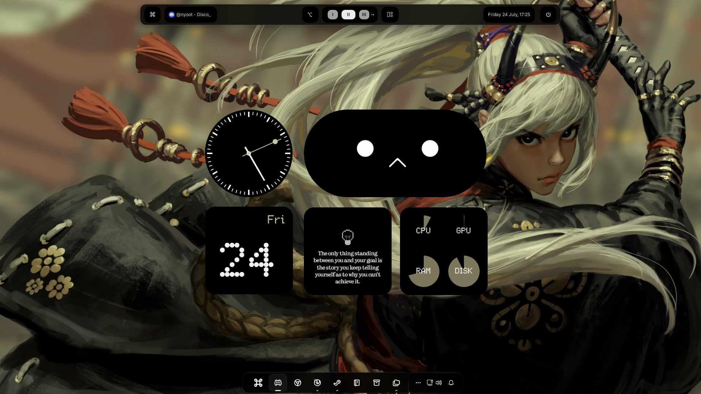

# Dawn Glass Theme — Komorebi Rice

<p align="center">
  
</p>

A Windows desktop rice built around [komorebi](https://github.com/LGUG2Z/komorebi) tiling window manager, with YASB as the status bar, Windhawk for shell tweaks, tacky-borders for window borders, and Rainmeter for extras.

Originally posted in the Komorebi Discord — sharing here so it's easier to track feedback, issues, and updates.

> **Note:** A one-click installer script is planned for a future release. Windows makes scripted dotfile installs annoying (no native symlink/config convention like Linux), so for now installation is manual. Bear with me.

## Preview

<p align="center">
  
</p>

## What's Included

| Folder | What it is |
|---|---|
| `fastfetch/` | Terminal system-info logo used in showcase screenshots |
| `komorebi/` | Tiling window manager config |
| `rainmeter/` | Rainmeter skin(s) |
| `tacky-borders/` | Custom window border styling |
| `walls/` | Personal wallpaper collection |
| `windhawk/` | Windhawk mod configs (text-based, see below) |
| `yasb/` | Status bar config |

## Installation

### fastfetch
Copy the `fastfetch` folder into your `.config` directory:
```
C:\Users\<your_name>\.config\
```

### komorebi
Same as above — goes in:
```
C:\Users\<your_name>\.config\
```

### tacky-borders
Same as above — goes in:
```
C:\Users\<your_name>\.config\
```

### rainmeter
A bit different since Rainmeter doesn't use `.config`:
1. Open Rainmeter, right-click any existing skin → **Open Skin Folder**
2. Copy this repo's `rainmeter` folder into the **parent** directory of that folder (i.e. your main Rainmeter skins folder, not a specific skin's folder)

### windhawk
These are text configs, not files to copy:
1. Install the mod named in each folder from the Windhawk mod store
2. Open the mod's settings page
3. Switch to **Textual mode**
4. Paste in the contents of the corresponding file from `windhawk/`

> Wishlist: it'd be great if Windhawk supported importing a folder as a backup/config source directly, instead of copy-pasting text.

### yasb
Copy the `yasb` folder into `.config` as well.

⚠️ **Heads up:** the included config was built for a **two-monitor** setup. If it doesn't behave correctly on a single monitor, please [open an issue](../../issues) and I'll get it fixed.

### walls
Just a personal wallpaper collection — drop into wherever you keep your wallpapers. Got a cool wallpaper you think fits the vibe? Feel free to suggest it via issue or PR.

## Feedback

This is very much a living project. If you:
- Get it working, let me know how it comes together!
- Have suggestions/improvements
- Have wallpapers to contribute
- Hit a bug (especially with `yasb` on single-monitor setups)

...please open an issue if there are any issues .

## Roadmap

- [ ] Open-source installer script (Windows-side scripting is the current blocker)
- [ ] Folder-import support for Windhawk configs (upstream feature request)
- [ ] More wallpaper variety

## License
[Add your license here — MIT is common for dotfiles/rices]
